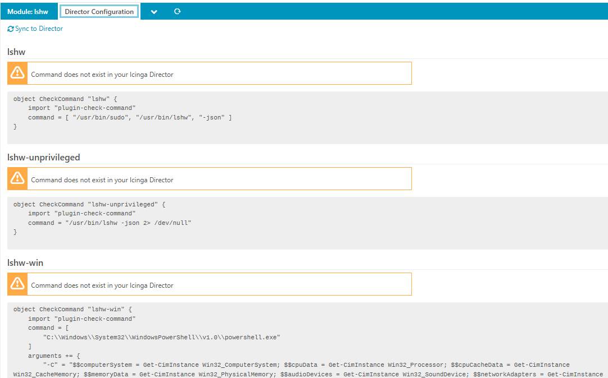

# Configuration <a id="module-lshw-configuration"></a>

## System Configuration  <a id="module-lshw-configuration-module-system"></a>

If you want all the systems details for linux you need run lshw as root.

Add the following line to your sudoes file:
```
%nagios ALL=(ALL) NOPASSWD: /usr/bin/lshw -json
```
If you are using an enterprise linux like redhat you user might me icinga instead of nagios.

You have to configure this on agents too if you want to execute lshw with root permissions on an agent.

## Director Configuration  <a id="module-lshw-configuration-module-director"></a>



The module comes with all the command definitons for Icinga Director.

Just click on "Sync to director" to create the commands.

After that you can create your service-templates as usual.

Don't forget to add "Run on Agent" if you want to execute the command on an agent node.